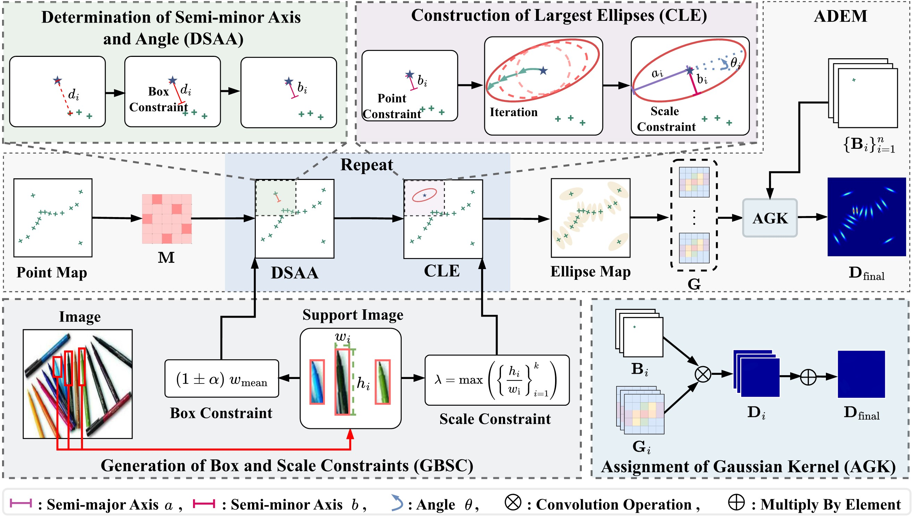

# Boosting Low-shot Object Counting with Adaptive Elliptic Density Map



## Setup

### Install the libraries

To run the code, install the following libraries: `PyTorch 1.13.1`, `Torchvision 0.14.1`, `scipy`, `numpy`,`PIL` and `astropy`.

### Download the dataset

Download the FSC147 dataset as instructed in its [official repository](https://github.com/cvlab-stonybrook/LearningToCountEverything). Make sure also to download the `annotation_FSC147_384.json` and `Train_Test_Val_FSC_147.json` and place them alongside the image directory (`images_384_VarV2`) in the directory of your choice.

```
├─FSC147/    
│  ├─gt_density_map_adaptive_384_VarV2/
│  ├─images_384_VarV2/
│  ├─ImageClasses_FSC147.txt
│  ├─Train_Test_Val_FSC_147.json
│  ├─ annotation_FSC147_384.json
```

### Generate adaptive elliptic density maps

```python
# generation
CUDA_VISIBLE_DEVICES=0 python adem.py --image_name [IMAGE_NAME] --data_path [DATA_PATH]

# visualization
CUDA_VISIBLE_DEVICES=0 python adem_show.py --image_name [IMAGE_NAME] --data_path [DATA_PATH]
```

## Acknowledgement

This project is based on implementation from [FamNet](https://github.com/cvlab-stonybrook/LearningToCountEverything), [SAFECount](https://github.com/zhiyuanyou/SAFECount), [LOCA](https://github.com/djukicn/loca), [CACViT](https://github.com/Xu3XiWang/CACViT-AAAI24), [CLIP-Count](https://github.com/songrise/clip-count), [CounTX](https://github.com/niki-amini-naieni/countx) and [VLCounter](https://github.com/seunggu0305/vlcounter).
