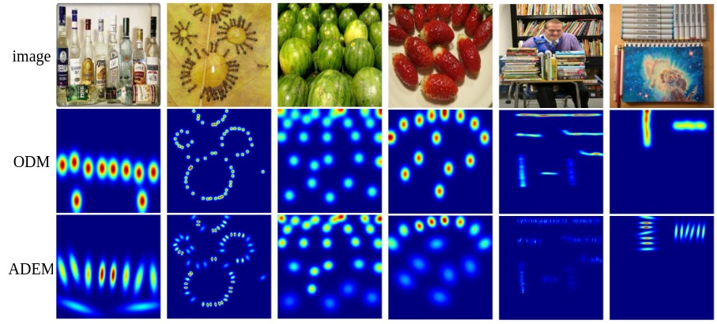

# Boosting Low-shot Object Counting with Adaptive Elliptic Density Map


### Environment

To run the code, install the following libraries: `PyTorch`, `Torchvision`, `numpy`,`PIL` and `astropy`.

```python
# CUDA 11.6
pip install torch==1.13.1+cu116 torchvision==0.14.1+cu116 torchaudio==0.13.1 --extra-index-url https://download.pytorch.org/whl/cu116
# CUDA 11.7
pip install torch==1.13.1+cu117 torchvision==0.14.1+cu117 torchaudio==0.13.1 --extra-index-url https://download.pytorch.org/whl/cu117
pip install PIL
pip install numpy
pip install astropy
```

### Dataset

Download the FSC147 dataset as instructed in its [official repository](https://github.com/cvlab-stonybrook/LearningToCountEverything). Make sure to also download the `annotation_FSC147_384.json` and `Train_Test_Val_FSC_147.json` and place them alongside the image directory (`images_384_VarV2`) in the directory of your choice.

```python
├─FSC147/    
│  ├─gt_density_map_adaptive_384_VarV2/
│  ├─images_384_VarV2/
│  ├─ImageClasses_FSC147.txt
│  ├─Train_Test_Val_FSC_147.json
│  ├─ annotation_FSC147_384.json
```

### Generate adaptive elliptic density map

```python
# generation
CUDA_VISIBLE_DEVICES=0 python adem.py --image_name [IMAGE_NAME] --data_path [DATA_PATH]

# visualisation
CUDA_VISIBLE_DEVICES=0 python adem_show.py --image_name [IMAGE_NAME] --data_path [DATA_PATH]
```

### Results

| Methods   | Val MAE | Val RMSE | Test MAE | Test RMSE |
| --------- | :-----: | :------: | :------: | :-------: |
| FamNet    |  23.54  |  69.74   |  20.58   |   90.68   |
| SAFECount |  13.15  |  44.59   |  12.79   |   90.74   |
| LOCA      |  10.69  |  32.47   |   9.77   |   45.18   |
| CACViT    |  10.59  |  40.62   |   8.73   |   37.66   |

| Methods    | Val MAE | Val RMSE | Test MAE | Test RMSE |
| ---------- | :-----: | :------: | :------: | :-------: |
| CLIP-Count |  17.31  |  58.89   |  15.91   |   98.58   |
| CounTX     |  17.68  |  65.47   |  14.98   |  104.15   |
| VLCounter  |  17.73  |  61.11   |  16.54   |  102.77   |

### Visualization



### Acknowledgement

This project is based on implementation from [FamNet](https://github.com/cvlab-stonybrook/LearningToCountEverything), [SAFECount](https://github.com/zhiyuanyou/SAFECount), [LOCA](https://github.com/djukicn/loca), [CACViT](https://github.com/Xu3XiWang/CACViT-AAAI24), [CLIP-Count](https://github.com/songrise/clip-count), [CounTX](https://github.com/niki-amini-naieni/countx) and [VLCounter](https://github.com/seunggu0305/vlcounter).
